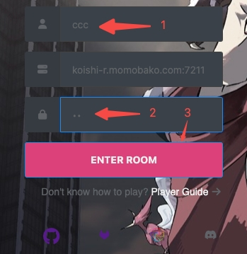
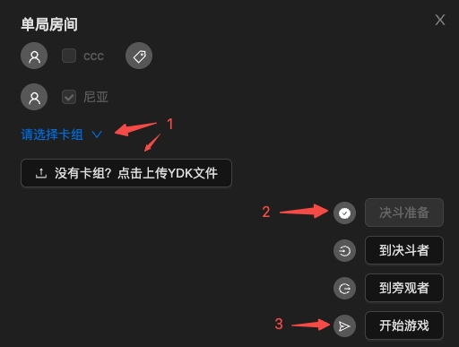
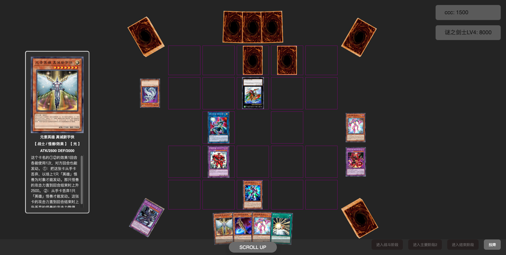

  <a href="https://www.neos.moe">
     
    <h1 align="center">Neos</h1>
  </a>

  
  
  
  

[English](./README.md) | 简体中文

Neos是一个基于[TypeScript](https://www.typescriptlang.org/)，[React.js](https://reactjs.org/)和[Babylon.js](https://www.babylonjs.com/)开发的网页版[游戏王](https://www.yugioh-card-cn.com/)对战平台。

## ✨ 功能

- 🎮 和[ygopro](https://ygopro.org/)客户端或者Neos本身进行[联机对战](https://neos.moecube.com)
- 🌍在局域网下进行对战
- 🤖️和游戏AI进行对战

## 📦快速开始
1. 进入[neos页面](https://neos.moecube.com)然后输入用户名（比如“ccc”）和房间密码(如果想要和人机进行对战的话房间密码需要输入“AI”), 然后点击`ENTER ROOM`按钮
2. 进入房间后，目前有两种办法选择您用来对战的卡组：
  - 点击下拉菜单选择推荐的预设卡组
  - 通过上传`YDK`文件来添加卡组
3. 卡组选择完成后，点击`决斗准备`和`开始游戏`按钮来进行一场愉快的决斗吧！

  
  

## 截图

  

## 文档
请移步[Neos文档](https://doc.neos.moe)。

## 部署站点
* 在萌卡社区部署的站点：https://neos.moecube.com
* 在[Cloudflare](https://www.cloudflare.com/)部署的站点：https://www.neos.moe

## 🤝贡献
在[gitlab仓库](https://code.mycard.moe/mycard/Neos)中创建`Merge Request`来进行代码贡献。

## 🔗Community
Neos目前在[萌卡社区](https://mycard.moe/)部署， 欢迎加入[QQ群](https://github.com/DarkNeos/ygopro-doc/blob/main/assets/ygo_qq.png)和我们一起交流。

## 为什么要开发Neos？
- [作者写的一篇文档](./docs/release-2023_02_19_CN.md)
- 在[ygobbs论坛](https://ygobbs.com/)发布的[帖子](https://ygobbs.com/t/ygopro%E7%BD%91%E9%A1%B5%E7%89%88%E5%BC%80%E5%8F%91%E8%BF%9B%E5%B1%95/403397)

## 更新
Neos项目会在每周末作者有空闲时间的时候更新（作者也是打工人）。

## 作者列表
- Chunchi Che ([@SKTT1Ryze](https://github.com/SKTT1Ryze))
- timelic [@timelic](https://github.com/timelic)

## 开源许可证
                    GNU GENERAL PUBLIC LICENSE
                       Version 3, 29 June 2007

 Copyright (C) 2007 Free Software Foundation, Inc. <https://fsf.org/>
 Everyone is permitted to copy and distribute verbatim copies
 of this license document, but changing it is not allowed.
