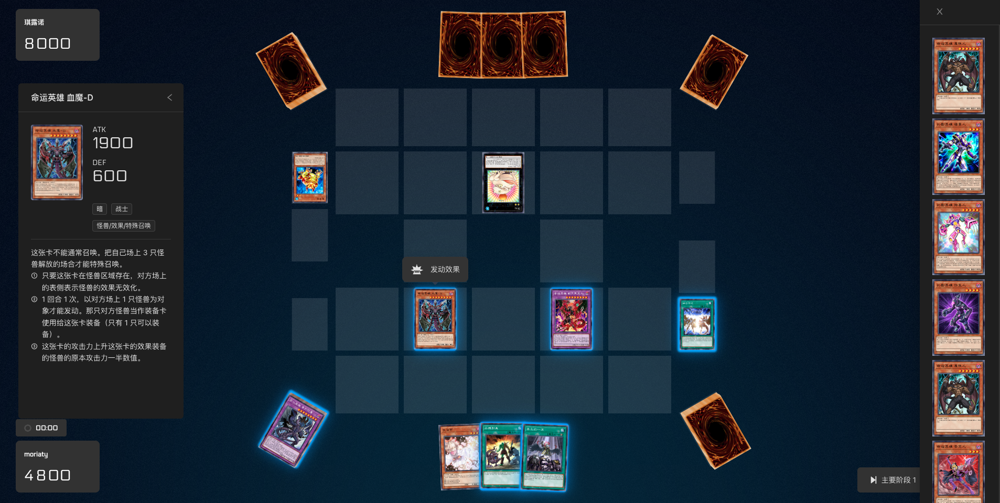

  <a href="https://www.neos.moe">
    <picture>
      
    </picture>
    <h1 align="center">Neos</h1>
  </a>

  
  
  
  

Neos is web version of [Yu-Gi-Oh!](https://www.yugioh-card.com/en/) game written in [TypeScript](https://www.typescriptlang.org/), [React.js](https://reactjs.org/) and [Babylon.js](https://www.babylonjs.com/). It supports the following features:

- [Play online](https://neos.moecube.com) with the [ygopro](https://ygopro.org/) client or Neos itself
- Play with LAN connection
- [WIP] Duel with AI

## Screenshot

  

## Deployed
* https://neos.moecube.com by Mycard community
* https://www.neos.moe by [Cloudflare](https://www.cloudflare.com/)

## Contributing
Create merge requests in [gitlab repo](https://code.mycard.moe/mycard/Neos).
## Community
Neos is developed in [mycard](https://mycard.moe/) community, join the [QQ Chat](https://github.com/DarkNeos/ygopro-doc/blob/main/assets/ygo_qq.png), where you can ask questions and make discussions.

## Why we develop Neos?
- [Document](https://github.com/DarkNeos/ygopro-doc/blob/main/doc/progress/2022-07-01_2022-10-07.md) by the author
- [Post](https://ygobbs.com/t/ygopro%E7%BD%91%E9%A1%B5%E7%89%88%E5%BC%80%E5%8F%91%E8%BF%9B%E5%B1%95/403397) in [ygobbs](https://ygobbs.com/) forum

## Updates
Update every weekend if the author is free.

## Authors
- Chunchi Che ([@SKTT1Ryze](https://github.com/SKTT1Ryze))

## Lincese
                    GNU GENERAL PUBLIC LICENSE
                       Version 3, 29 June 2007

 Copyright (C) 2007 Free Software Foundation, Inc. <https://fsf.org/>
 Everyone is permitted to copy and distribute verbatim copies
 of this license document, but changing it is not allowed.
